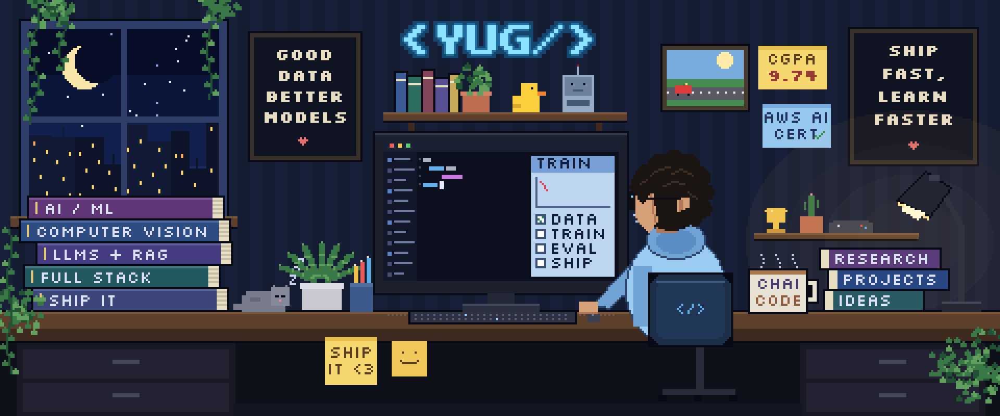

  

<h1 align="center">Yug Agrawal</h1>

  <b>AI/ML Engineer &nbsp;·&nbsp; Full-Stack Developer</b> 
  Computer Science @ SRM Institute of Science and Technology, Chennai

  &nbsp;
  &nbsp;
  

 

## About

I build machine learning systems that make it out of the notebook: models that predict from live data streams, run efficiently on edge hardware, and sit behind production-grade APIs.

My work sits where **applied ML** meets **software engineering**. On the ML side that means computer vision, real-time prediction and local LLM tooling. On the engineering side it means clean backends in FastAPI and PostgreSQL, typed frontends in Next.js, and containerised deployments.

**Education:** B.Tech Computer Science, SRM IST, 3rd year, CGPA 9.74 / 10 
**Certification:** AWS Certified AI Practitioner 
**Focus:** Applied ML · Computer Vision · LLM Systems · Backend Engineering 
**Open to:** SDE and ML internships, research collaborations, freelance projects

 

## Selected Work

<table>
  <tr>
    <td width="50%" valign="top">
      <h3><a href="https://github.com/yugagrawal031205/TransitLens">TransitLens</a></h3>
      Real-time bus delay prediction for New York City. Ingests MTA GTFS-Realtime feeds, matches live vehicles to their exact scheduled trips, and serves a 21-feature Random Forest with leakage-safe historical aggregates across 41 Manhattan routes.
        
      <b>MAE of 155.6 s, 23% better than the median baseline.</b>
        
      Python · scikit-learn · Pandas · SQLite · Streamlit
    </td>
    <td width="50%" valign="top">
      <h3><a href="https://github.com/yugagrawal031205/EdgeVisionn">EdgeVision</a></h3>
      Plant disease classification built for edge devices. A MobileNetV3-Small model trained on PlantVillage and exported to ONNX Runtime for low-latency inference from a webcam or phone camera, served end-to-end through a FastAPI backend and a React client.
        
      PyTorch · ONNX Runtime · OpenCV · FastAPI · React · TypeScript
    </td>
  </tr>
  <tr>
    <td width="50%" valign="top">
      <h3><a href="https://github.com/yugagrawal031205/research-pilot">ResearchPilot</a></h3>
      A local-first research assistant. Upload a paper and Llama 3 (via Ollama) returns a structured breakdown of its methodology, results and limitations, suggests open research gaps, and answers follow-up questions. No data leaves the machine.
        
      Llama 3 · Ollama · Next.js · Node.js · Express · Tailwind
    </td>
    <td width="50%" valign="top">
      <h3><a href="https://github.com/yugagrawal031205/stackhire">StackHire</a></h3>
      A hiring platform with separate company and candidate roles, JWT authentication, filtering, and an application pipeline that tracks every candidate from pending to interview to decision. Fully containerised with Docker Compose.
        
      FastAPI · SQLAlchemy · PostgreSQL · Next.js · React 19 · Docker
    </td>
  </tr>
  <tr>
    <td width="50%" valign="top">
      <h3><a href="https://github.com/yugagrawal031205/FinTrack">FinTrack</a></h3>
      A personal finance tracker with bcrypt and JWT authentication, strict per-user data isolation, and category-level analytics, built on a three-tier Next.js, FastAPI and PostgreSQL architecture.
        
      FastAPI · PostgreSQL · SQLAlchemy · Next.js · Docker
    </td>
    <td width="50%" valign="top">
      <h3><a href="https://github.com/yugagrawal031205/Campus-Marketplace">Campus Marketplace</a></h3>
      A marketplace where students buy and sell textbooks, electronics and hostel essentials, with Firebase authentication, Cloudinary media hosting, search and category filters.
        
      Next.js · FastAPI · MongoDB Atlas · Firebase · Cloudinary
    </td>
  </tr>
</table>

## Tech Stack

<table>
  <tr>
    <td width="170"><b>Languages</b></td>
    <td></td>
  </tr>
  <tr>
    <td><b>Machine Learning</b></td>
    <td></td>
  </tr>
  <tr>
    <td><b>Backend &amp; Data</b></td>
    <td></td>
  </tr>
  <tr>
    <td><b>Frontend</b></td>
    <td></td>
  </tr>
  <tr>
    <td><b>Cloud &amp; DevOps</b></td>
    <td></td>
  </tr>
</table>

Also working with: NumPy · Pandas · ONNX Runtime · Hugging Face · LangChain · Ollama · Streamlit · Jupyter

## GitHub Activity

  

  
  

---

  If you're working on something in applied ML or need a hand shipping a product, reach me at <a href="mailto:yugagrawal2017@gmail.com">yugagrawal2017@gmail.com</a> or on <a href="https://www.linkedin.com/in/yug-agrawal03/">LinkedIn</a>.

